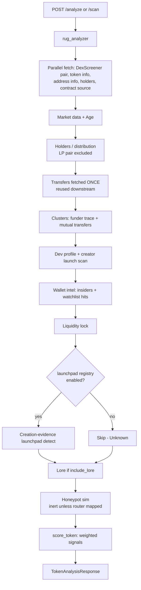
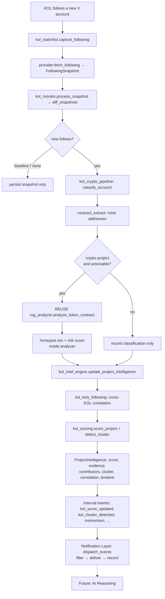
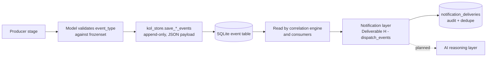
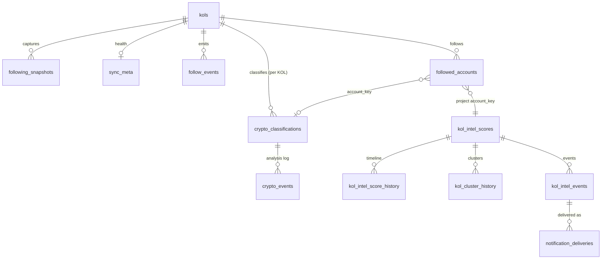

# Robinhood Rug Analyzer — System Architecture

> **Canonical architecture reference.** This document describes the system **as
> implemented**, not as originally designed. Where the implementation diverges
> from `ROADMAP.md`, the implementation is authoritative and documented here.
> All future roadmap milestones should align to this document.

**Companion documents**

- [`ARCHITECTURE_DIAGRAMS.md`](./ARCHITECTURE_DIAGRAMS.md) — all Mermaid diagrams
  (overall architecture, service dependency graph, DB relationships, event
  pipeline, KOL pipeline, analysis pipeline, notification + future-AI).
- [`DATA_FLOW.md`](./DATA_FLOW.md) — the end-to-end lifecycle traced call-by-call.
- [`kol_intelligence.md`](./kol_intelligence.md) — deep dive on the KOL provider
  abstraction and the X scraper (M23 Deliverables A/B).

---

## Table of contents

1. [High-Level Architecture](#1-high-level-architecture)
2. [End-to-End Data Flow](#2-end-to-end-data-flow)
3. [Module Documentation](#3-module-documentation)
4. [Current Folder Structure](#4-current-folder-structure)
5. [Service Dependency Graph](#5-service-dependency-graph)
6. [Event Pipeline](#6-event-pipeline)
7. [Persistence Layer](#7-persistence-layer)
8. [Configuration System](#8-configuration-system)
9. [Analysis Pipeline](#9-analysis-pipeline)
10. [KOL Intelligence](#10-kol-intelligence)
11. [Testing Strategy](#11-testing-strategy)
12. [Design Principles](#12-design-principles)
13. [Extension Guides](#13-extension-guides)
14. [Roadmap Alignment](#14-roadmap-alignment)
15. [Technical Debt](#15-technical-debt)
16. [Future Architecture](#16-future-architecture)
17. [Mermaid Diagrams](#17-mermaid-diagrams)
18. [Developer Onboarding](#18-developer-onboarding)

---

## 1. High-Level Architecture

The Robinhood Rug Analyzer is a **single-chain** (Robinhood Chain, id `4663`)
FastAPI application that screens tokens for rug-pull risk using only free,
public data sources, and — in an opt-in, still-internal layer — turns the
follow-graph movements of tracked social KOLs into leading intelligence.

It has two broad halves that share infrastructure but run independently:

- **On-chain analysis (v1, live):** the request-driven `/analyze` and `/scan`
  API that composes market, holder, cluster, dev, liquidity, launchpad,
  honeypot, and lore signals into an explainable 0–100 risk score.
- **KOL Intelligence (M23, opt-in, engine-internal):** a background pipeline
  that scrapes tracked KOLs' X following lists, diffs them, classifies newly
  followed crypto accounts, **reuses** the on-chain analyzer on any contracts
  found, and correlates convergence across KOLs into a KOL Intelligence Score.

### Subsystems

| Subsystem | Where | Responsibility |
|---|---|---|
| **Data Collection** | `blockscout_client`, `dexscreener_client`, `rpc_client`, `lore_client` | Fetch token metadata, holders, transfers, market pairs, contract source, chain state (`eth_call`), and public web lore. All degrade to `None`/`[]`. |
| **Social Intelligence** | `social/` package | Platform-neutral provider abstraction; X scraping via persistent Playwright session; snapshot diffing. |
| **Contract Analysis** | `contract_intel`, `contract_privileges`, `analyzers` | Verified-source template/protocol inference; live privilege/authority reads (owner/paused, mint/pause/blacklist/fee powers); pure per-dimension analysis (age, holders, clusters, dev, LP lock, launchpad). |
| **Honeypot Simulation** | `honeypot_sim`, `route_discovery`, `core/honeypot_artifact` | Simulated buy→sell round-trip via `eth_call` state override; off-chain route discovery. Inert unless a DEX router is mapped. |
| **Route Discovery** | `route_discovery` | Liquidity-verified Uniswap v3 path (direct or WETH→quote→token) for the honeypot prober. |
| **Wallet Intelligence** | `wallet_intel`, `watchlist_store` | Insider detection + heuristic smart-wallet proxy; persistent wallet watchlist. |
| **Launchpad Detection** | `launchpad_registry` | On-chain-marker registry → launchpad / LP-locker / established-token classification. Empty by design in production. |
| **Risk Scoring** | `scoring` | Weighted, additive, fully explainable 0–100 risk score + independent data-completeness confidence. |
| **Alpha Scoring** | *(not implemented)* | Reserved as an optional KOL scoring component (`kol_score_weights["alpha"]`); contributes nothing until an alpha scorer exists. |
| **KOL Intelligence** | `kol_store`, `kol_watchlist`, `kol_monitor`, `kol_crypto_pipeline`, `kol_intel_engine`, `social/kol_scoring` | Follow-graph capture → diff → crypto classification → analyzer reuse → scoring/correlation/clustering. |
| **Event Pipeline** | `kol_store` tables + model vocabularies | Append-only, engine-internal event/timeline logs (follow, crypto, intel). No delivery transport yet. |
| **Persistence Layer** | `watchlist_store` (wallets), `kol_store` (KOL) | Two independent stdlib-`sqlite3` stores, each lock-guarded. |
| **Configuration System** | `core/config.py` | One pydantic `BaseSettings`; every threshold/weight/toggle is env-overridable config. |
| **Scheduler** | `main.py` lifespan | One asyncio background loop (`_watchlist_refresh_loop`). KOL captures have no scheduler yet. |
| **Notification Layer** | `notifications.py` (Deliverable H) | Consumes intel events + `ProjectIntelligence`, forwards alert-worthy ones to configured providers (`log`, `memory`). Opt-in, rule-filtered, deduped, failure-isolated. See §6.1. |
| **AI Intelligence Layer** | *(planned)* | `ProjectIntelligence` + timelines are shaped as self-describing input for a future AI reasoning stage. |

See [§17](#17-mermaid-diagrams) for the overall architecture diagram.

---

## 2. End-to-End Data Flow

There are two independent entry paths. Full call-by-call detail lives in
[`DATA_FLOW.md`](./DATA_FLOW.md); the lifecycle is summarized here.

### 2a. On-chain analysis (request-driven)



### 2b. KOL Intelligence (the flagship leading-signal pipeline)



Key properties of the KOL flow:

- **Baseline safety** — the first snapshot for a KOL produces no follow events
  (everything is "unchanged from unknown"), so establishing a baseline never
  floods the log.
- **Reuse, not recompute** — the crypto pipeline calls the *existing*
  `rug_analyzer` (cached, deduped across KOLs); the correlation engine reads the
  stored analysis summary rather than re-running it.
- **Incremental** — `update_project_intelligence` fingerprints its inputs and
  short-circuits when nothing changed, skipping rescore/history/events.
- **Delivery is decoupled** — the engine persists engine-internal events, then
  hands them to the notification layer (Deliverable H, §6.1), which filters and
  delivers to configured sinks. Delivery is opt-in and failure-isolated, so it
  never affects the correlation/capture path. The arrow to "AI Reasoning" is
  still planned, not built.

---

## 3. Module Documentation

Each module lists Purpose / Inputs / Outputs / Dependencies / Public interface /
Configuration / Extension points / Failure modes.

### 3.1 API and app shell

**`app/main.py`** — FastAPI app factory; mounts the API router and the static
frontend; owns the lifespan-scoped background scheduler.
- Dependencies: `api.routes`, `core.config`, `core.logging_config`, `services.http`, `services.wallet_intel`.
- Public: the ASGI `app`, `lifespan()`, `_watchlist_refresh_loop()`.
- Config: `cors_origins`, `watchlist_refresh_*`, `app_name`, `app_version`.
- Extension: add a background loop as an `asyncio.create_task` in `lifespan`, guarded by an enable flag (this is where a future KOL capture scheduler lands).
- Failure modes: the refresh loop wraps each cycle in try/except so it never dies; forces correct MIME types on Windows so the frontend never serves unstyled.

**`app/api/routes.py`** — the v1 REST surface under `/api/v1`.
- Public: `GET /chain`, `POST /analyze`, `POST /scan`, `GET /watchlist`, `GET /wallet/{address}`.
- Dependencies: `rug_analyzer`, `watchlist_store`, token models.
- Failure modes: address validated in the request model; unknown wallet returns 404. No KOL routes are exposed (the KOL engine is background/internal today).

### 3.2 Analysis pipeline services

**`app/services/rug_analyzer.py`** — orchestrator that composes all sub-analyses.
- Public: `analyze_token_contract(contract_address, include_lore=True)`, `scan_and_rank(limit, include_lore=False)`.
- Dependencies: `analyzers`, `blockscout_client`, `dexscreener_client`, `contract_intel`, `honeypot_sim`, `launchpad_registry`, `rpc_client`, `wallet_intel`, `watchlist_store`, `lore_client`, `scoring`.
- Config: `holder_sample_size`, `holder_scan_pages`, `transfer_scan_pages`, `scan_max_tokens`, `scan_tiering_enabled`, `scan_established_holder_floor`, `scan_light_promote_threshold`, `scan_max_deep_analyses`, `chain_name`.
- Extension: insert a fetch/analyze step and thread its typed result into `score_token` (see section 13).
- Failure modes: raises `ValueError` on invalid address; every sub-fetch degrades to `None`/`[]`; `scan_and_rank` wraps each deep analysis so one bad token is dropped; funder/creator traces use `gather(return_exceptions=True)`.

**`app/services/scoring.py`** — weighted, additive, explainable risk scoring (pure).
- Public: `score_token(*, age, market, holders, clusters, dev, liquidity_lock, launchpad, lore, data_sources, honeypot=None) -> RugAnalysis`; `score_token_light(holder_count) -> RugAnalysis`.
- Dependencies: pure, only `models.token`; no I/O, no settings (thresholds are inline constants).
- Extension: append a scoring block plus a `_CONFIDENCE_WEIGHTS` entry.
- Failure modes: cannot raise on missing data; absent dimensions produce no signals. Full model in section 9.

**`app/services/honeypot_sim.py`** — simulated buy/sell round-trip via `eth_call` state override.
- Public: `simulate(token_address, market) -> HoneypotResult`; `classify(spent, bought, sold_back) -> HoneypotResult` (pure).
- Dependencies: `route_discovery`, `rpc_client`, `cache`; chain RPC.
- Config: `honeypot_sim_enabled`, `dex_routers`, `honeypot_weth_address`, `honeypot_prober_code`, `honeypot_prober_selector`, `honeypot_sim_buy_wei`, `honeypot_high_tax_pct`, cache settings.
- Extension: map a DEX in `dex_routers`; supply per-chain router/WETH/factory/prober config.
- Failure modes: inert by default (no router mapped -> no calls); every uncertainty -> `status="unknown"`, never a false "sellable". Real verdicts cached; "unknown" never cached (stays retryable).

**`app/services/route_discovery.py`** — off-chain, liquidity-verified Uniswap v3 path.
- Public: `discover_route(token_address) -> Route | None`; `encode_path(tokens, fees)` (pure); `Route` dataclass.
- Dependencies: `rpc_client` (factory `getPool` + ERC-20 `balanceOf`).
- Config: `honeypot_v3_factory`, `honeypot_weth_address`, `honeypot_quote_assets`, `honeypot_fee_tiers`, `honeypot_min_quote_reserve`.
- Extension: append a quote asset to `honeypot_quote_assets` (config only, no recompile).
- Failure modes: missing config or no liquid path -> `None`, never raises. Uses reserves (not `liquidity()`), rejects dust pools below the per-asset floor.

**`app/services/contract_intel.py`** — verified-source template/protocol inference.
- Public: `fetch_contract_intel(address) -> ContractIntel`; `infer_from_contract(payload)` (pure).
- Dependencies: `blockscout_client.get_smart_contract`.
- Extension: append tuples to `TEMPLATE_SIGNATURES` / `PROTOCOL_SIGNATURES` (first match wins).
- Failure modes: unverified/missing source -> `template="unknown"`, `verified=False`; never raises.

**`app/services/contract_privileges.py`** — live authority/privilege reads (M11).
- Public: `fetch_privileges(address, payload) -> ContractPrivileges` (fires ≤2 `eth_call`s); `infer_privileges(payload, owner_hex, paused_hex)` (pure).
- Dependencies: shares `blockscout_client.get_smart_contract`'s payload (no extra fetch); `rpc_client.eth_call` for live `owner()`/`paused()`.
- Detects mint/pause/blacklist/fee-mutation powers from the verified ABI; a confirmed renounce (owner == zero) silences the retained-power signals.
- Failure modes: unverified/no ABI -> `analyzed=False` (never a false "no powers"); unknown ownership keeps powers flagged; RPC errors -> `None`, never raises.

**`app/services/launchpad_registry.py`** — on-chain-marker registry (pure).
- Public: `detect_launchpad(creator, contract_name, tags)`, `match_creation_evidence(factory_to, log_topics)`, `has_enabled_launchpads()`, `is_established_token(symbol, name)`, `locker_label(address)`, `is_burn_address(address)`, `locker_unlock_spec(address)` (M13: unlock-read spec for a verified locker, or None), `normalize(...)`.
- Data: `LAUNCHPADS` and `LP_LOCKERS` are **empty by design in production**; `BURN_ADDRESSES` holds `0x0` and `0x..dead`.
- Extension: add verified entries (with `source`, `verified_date`, `enabled: True`); add established symbols / name hints.
- Failure modes: no crashes; empty registry deliberately degrades to "Unknown" rather than a false "locked"/"safe" claim.

**`app/services/analyzers.py`** — pure per-dimension analysis helpers.
- Public: `analyze_age`, `analyze_holders`, `analyze_clusters` (union-find of shared-funder + mutual-transfer links; M14: shared-funder link is multi-hop via `funder_chains`), `analyze_bundle` (M14: grade the bundler/sybil-launch pattern from the clustering — score 0-100 + Normal/Moderate/Heavy/Extreme, additive metadata), `analyze_buy_timing` (M15: same-block / launch-window buy-cohort detection from normalized transfers, additive metadata), `analyze_dev`, `analyze_dev_transfers`, `analyze_liquidity_lock`, `decode_unlock_timestamp`/`apply_unlock_schedule` (M13: fold a locker's unlock time into a time-aware LP-lock verdict), `analyze_launchpad`, `classify_created_tokens`, `extract_mutual_transfers`, `to_float`/`to_int`.
- Dependencies: `launchpad_registry`, `models.token`, `settings`.
- Extension: add an `analyze_*` helper returning a typed model, wire it into orchestrator + scorer.
- Failure modes: pure and defensive; never raise on partial data. Holder analysis peels out the LP pair so top1/top10/concentration reflect real wallets.

**`app/services/wallet_intel.py`** — insider detection + heuristic smart-wallet proxy.
- Public: `normalize_transfers`, `detect_insiders(...)`, `smart_wallet_proxy(...)`, `profile_token_wallets(...)`, `refresh_watchlisted(batch)`.
- Dependencies: `blockscout_client`, `watchlist_store`, `analyzers`.
- Config: `insider_early_buyer_count`, `smart_wallet_min_proxy_score`, `transfer_scan_pages`.
- Extension: compute cross-token `surviving_tokens` to activate smart-wallet promotion (see section 15).
- Failure modes: persistence wrapped in try/except (never blocks analysis); `refresh_watchlisted` uses `gather(return_exceptions=True)`. Note: in single-token analysis the `smart` list is always empty (max proxy 65 < threshold 70) — a documented, designed inert state.

### 3.3 Data clients and infrastructure

**`app/services/blockscout_client.py`** — Blockscout REST v2 for Robinhood Chain.
- Public: `get_token_info`, `get_token_counters`, `get_token_holders`, `get_token_holders_paged(address, pages)`, `get_address_info` (cached), `get_address_token_transfers`, `get_address_token_holdings` (M16: a wallet's current token holdings, for cross-token survival), `get_address_transactions`, `get_smart_contract` (cached), `get_transaction_timestamp` (cached), `get_transaction` (cached), `get_transaction_logs` (cached), `get_token_transfers(address, pages)`, `list_tokens(token_type, limit)`.
- Dependencies: `http.get_client`, `cache`. Config: `blockscout_base_url`, cache settings.
- Failure modes: central `_get` returns `None` on any HTTP/JSON error. **Only immutable reads are cached**; holders/transfers/counters/market are always live.

**`app/services/rpc_client.py`** — raw JSON-RPC over `rpc_url`.
- Public: `eth_call(to, data, block="latest", state_override=None)` (not cached), `get_transaction_by_hash` (cached), `get_transaction_receipt` (cached).
- Failure modes: `_rpc` returns `None` on transport error, bad JSON, or a JSON-RPC `error` object.

**`app/services/dexscreener_client.py`** — DexScreener public pairs.
- Public: `fetch_token_pairs(address)` (filtered to `dexscreener_chain`), `choose_best_pair(pairs)` (highest USD liquidity).
- Config: `dexscreener_chain`. Failure modes: returns `[]` on error; not cached.

**`app/services/lore_client.py`** — public web lore + optional LLM summary.
- Public: `build_lore(name, symbol, market_socials=None, websites=None) -> TokenLore`.
- Dependencies: DuckDuckGo HTML endpoint, optional LLM API. Uses its own `httpx.AsyncClient` (not the shared pool).
- Config: `http_timeout`, `llm_api_key`, `llm_base_url`, `llm_model`.
- Failure modes: DDG/LLM failures return `[]`/`None`, never raise. Only `sentiment == "negative"` feeds scoring.

**`app/services/cache.py`** — `TTLCache` (bounded, oldest-first eviction, expiry-on-read) + `cached_call(cache, key, factory)` which never caches a `None` result. `MISS` sentinel.

**`app/services/http.py`** — one shared bounded `httpx.AsyncClient` singleton (`get_client`, `aclose`). `Limits(max_connections=http_max_connections)` doubles as a global concurrency/rate cap across the whole scan fan-out. Config: `http_timeout`, `http_max_connections`.

**`app/core/config.py`** — a single pydantic `BaseSettings` (`Settings`) with `get_settings()` (lru-cached) and the module-level `settings`. Every threshold/weight/toggle here; env/`.env` overridable. See section 8.

**`app/core/logging_config.py`** — logging setup (`configure_logging()`).

**`app/core/honeypot_artifact.py`** — pinned generated artifact: `PROBER_SELECTOR`, `PROBER_RUNTIME_CODE` (compiled runtime bytecode of `contracts/HoneypotProber.sol`, solc 0.8.24), and verified Robinhood Chain addresses (`ROBINHOOD_WETH`, `ROBINHOOD_USDG`, `ROBINHOOD_SWAPROUTER02`, `ROBINHOOD_V3_FACTORY`). Consumed as defaults in `config.py`.

### 3.4 Persistence

**`app/services/watchlist_store.py`** — persistent wallet watchlist (stdlib sqlite3, lock-guarded).
- Public: `upsert_wallet`, `record_activity`, `get_watchlist(kind=None)`, `get_wallet`, `known_addresses`, `refresh_addresses`, `reset_for_tests`.
- Tables: `wallets` (PK `address`), `wallet_activity` (UNIQUE `(wallet, token_address, timestamp)`).
- Config: `watchlist_db_path`. Failure modes: defensive; callers wrap writes in try/except.

**`app/services/kol_store.py`** — the KOL subsystem's raw sqlite3 store (11 tables, lock-guarded, at `kol_db_path`). Full schema in section 7. Notable cross-KOL correlation reads: `list_kols_following`, `best_classification_for_account`, `latest_analysis_summary`. All JSON deserialization degrades gracefully (corrupt rows skipped, never raised).

### 3.5 KOL orchestration services

**`app/services/kol_watchlist.py`** — the public facade; the only KOL module callers should touch.
- Public: `add_kol`, `update_kol`, `set_enabled`, `set_tier`, `remove_kol`, `get_kol`, `list_kols`, `get_watch_status`, `sync_from_config(seeds=None)`, `capture_following(handle, platform)`.
- Dependencies: `kol_store`, `kol_monitor`, `kol_crypto_pipeline`, `kol_intel_engine`, `social` registry/base.
- Config: `kol_default_platform`, `kol_watchlist_seed`, `kol_config_overwrites`.
- Extension: `sync_from_config` reconciles `kol_watchlist_seed` (always adds missing; overwrites only when `kol_config_overwrites`; never auto-deletes).
- Failure modes: validates at the boundary (raises `ValueError`/`KeyError`); typed `ProviderError` -> failed sync + status "error" + re-raise; incomplete snapshot -> failed sync (not raised, retryable); crypto + intel stages wrapped in broad try/except and swallowed ("intelligence is additive; capture already succeeded").

**`app/services/kol_monitor.py`** — snapshot processing (Deliverable C).
- Public: `process_snapshot(snapshot) -> SnapshotDiff | None`.
- Dependencies: `kol_store`, `social.diff`.
- Failure modes: returns `None` (persists nothing) when the snapshot is incomplete, so an interrupted scrape never overwrites the baseline or reads as a mass unfollow. Diffs against `latest_complete_snapshot`, then persists snapshot -> follow events -> profile changes -> followed-account first/last-seen. Does not alert/score/cluster/classify.

**`app/services/kol_crypto_pipeline.py`** — crypto detection + rug-analyzer reuse (Deliverable D).
- Public: `process_new_follow(...)`, `process_new_follows(...)`, `reset_cache_for_tests()`.
- Dependencies: `kol_store`, `rug_analyzer`, `cache`, `social.crypto_intel`.
- Config: `kol_crypto_intel_enabled`, `kol_crypto_min_score`.
- Behavior: classify -> save; if crypto project and score >= min, emit `crypto_project_detected` + `contract_extracted`, then for each supported contract call the existing `rug_analyzer.analyze_token_contract` through a per-address TTLCache (dedup across KOLs) and emit `analysis_completed` / `analysis_failed`.
- Failure modes: disabled -> no-op; a single contract's analysis failure is captured as an event, never raised.

**`app/services/kol_intel_engine.py`** — scoring + correlation orchestrator (Deliverable F).
- Public: `update_project_intelligence(platform, account_key, *, project_handle=None, force=False)`, `process_new_project_follows(platform, accounts, *, project_keys=None)`.
- Dependencies: `kol_store`, `social.kol_scoring`, `notifications` (dispatch only).
- Config: `kol_score_enabled`, `kol_momentum_min_new_kols`, plus everything `kol_scoring` reads.
- Behavior: build contributors from `list_kols_following` -> reuse best classification + latest analysis summary -> fingerprint inputs (short-circuit if unchanged) -> `detect_cluster` -> `score_project` -> `detect_cluster` again with the score (to tag `high_conviction`) -> assemble `ProjectIntelligence` -> persist + emit internal events -> `notifications.dispatch_events` (Deliverable H, best-effort).
- Failure modes: never raises out of the public entrypoints (logged/swallowed).

**`app/services/notifications.py`** — notification & delivery layer (Deliverable H).
- Public: `dispatch_events(events, intel)`, `register_provider(provider)`, `NotificationProvider` ABC, `LogNotificationProvider`, `MemoryNotificationProvider`, `reset_for_tests()`.
- Dependencies: `kol_store` (delivery log + dedupe), `models.kol`.
- Config: `notify_enabled`, `notify_providers`, `notify_min_score`, `notify_min_confidence`, `notify_min_cluster_size`, `notify_event_types`.
- Behavior: consume the just-persisted intel events -> filter by config rules against the given `ProjectIntelligence` -> skip already-delivered (event, destination) pairs -> deliver via each provider -> record every attempt in `notification_deliveries`. Generates no intelligence.
- Failure modes: no-ops when disabled; a failing provider or store write is logged, recorded, and swallowed — never propagates to the caller.

### 3.6 Social provider package (`app/services/social/`)

**`base.py`** — `SocialGraphProvider` ABC (the single engine-to-platform seam) and `ProviderError`. Abstract: `capabilities()`, `normalize_handle()`, `account_url()`, `async fetch_following()`. Concrete helper `build_account()`.

**`registry.py`** — process-global platform-key -> provider map (RLock-guarded). Public: `register_provider`, `get_provider` (returns `None`, never raises, for unwired platforms), `is_supported`, `available_platforms`, `reset_for_tests`. Lazily installs `XProvider` as the only default.

**`x_provider.py`** — the X provider (`platform="x"`). Capabilities: `can_fetch_following=True`, `provides_stable_ids=True`, `requires_auth_session=True`. `fetch_following` builds a session (injectable `session_factory`), scrapes, and wraps any non-typed error as `TransientNetworkError`. Config: none directly.

**`x_session.py`** — persistent authenticated Playwright browser context (Playwright imported lazily). `XSession` owns auth state: `open`, `close`, `is_authenticated`, `ensure_ready` (raises `AuthUnavailableError`/`SessionExpiredError`), `login_interactive` (headful, manual — never automates credentials). Config: `x_user_data_dir`, `x_headless`, `x_nav_timeout_ms`, `x_browser_executable`.

**`x_scraper.py`** — pure page-driven DOM logic on an injected page (fully fakeable). `scrape_following(page, handle) -> ScrapeResult`, `classify_profile_state` (raises rate-limit/unavailable/private from visible markers), `scroll_and_collect`, `to_accounts`. Config: `x_scroll_pause_ms`, `x_scroll_max_rounds`, `x_scroll_stable_rounds`, `x_following_max`, `x_nav_timeout_ms`.

**`diff.py`** — pure snapshot diff (Deliverable C). `diff_snapshots(previous, current) -> SnapshotDiff`. Keys by stable id (else lowercased handle); `previous is None` -> baseline (no events); tracks handle/display_name/bio/verified changes (only when both sides known). A rename surfaces as a `handle` ProfileChange, not unfollow+follow.

**`crypto_intel.py`** — pure account classification (Deliverable D). `classify_account(account) -> CryptoClassification`; `build_profile_intelligence(account)`. Applies a corroboration gate: a project verdict requires a strong signal or >= `kol_crypto_min_signals`, and score >= `kol_crypto_min_score`. Config: `kol_crypto_confidence_bands`, `kol_crypto_strong_signals`, `kol_crypto_min_signals`, `kol_crypto_min_score`.

**`crypto_signals.py`** — config-driven pure signal registry (Deliverable D). `detect_signals(intel, contracts) -> list[Evidence]`; `registered_signals()`. 16 detectors; only those with a positive `kol_crypto_signal_weights` weight fire. Extension: register `(name, detector)` + a config weight.

**`contract_extract.py`** — pure address mining (Deliverable D), no network. `extract_contracts(...)`, `extract_from_fields(...)`. EVM validated by `models.token.is_valid_address`; `supported=True` only for EVM on `{dexscreener_chain, ethereum, base, robinhood}`. Non-EVM chains recorded but `supported=False` (never dropped). Config: `dexscreener_chain`, `kol_crypto_max_contracts_per_account`.

**`kol_scoring.py`** — the pure scorer + cluster detector (Deliverable F), no I/O. `score_project(...) -> (score, confidence_band, evidence)`; `detect_cluster(...) -> ClusterInfo`; `tier_weight`, `score_confidence_band`. Full scoring model in section 10. Config: `kol_tier_weights`, `kol_tier_default_weight`, `kol_score_weights`, `kol_tier_quality_divisor`, `kol_confidence_multipliers`, `kol_score_confidence_bands`, `kol_cluster_*`.

**`errors.py`** — the provider error taxonomy: `SessionExpiredError`, `AuthUnavailableError`, `RateLimitedError` (retryable, `retry_after_seconds`), `TransientNetworkError` (retryable), `AccountPrivateError`, `AccountUnavailableError`. Rule: a scrape failure always degrades to an explicit typed error, never a silent empty that reads as "follows nobody".

---

## 4. Current Folder Structure

```text
robinhood-rug-analyzer/
├── app/
│   ├── api/            # FastAPI route handlers (/analyze, /scan, /chain, /watchlist)
│   ├── core/           # config (settings), logging, pinned honeypot artifact
│   ├── models/         # Pydantic domain models: token.py (analysis), kol.py (KOL intel)
│   ├── services/       # all business logic
│   │   └── social/     # platform-neutral provider abstraction + pure KOL logic
│   └── main.py         # ASGI app: API + static frontend + background scheduler
├── contracts/          # HoneypotProber.sol + compiled bin-runtime (source of the pinned artifact)
├── scripts/            # throwaway live-validation probes (probe_honeypot_e2e, probe_rpc_overrides)
├── frontend/           # static HTML/CSS/JS UI (scanner + drill-down)
├── data/               # runtime sqlite DBs (watchlist.db, kol.db) + x_profile session dir
├── docs/               # this document + companions + kol_intelligence.md
├── tests/              # pytest suite (pure + orchestration, no live network)
├── logs/               # runtime logs
├── render.yaml         # Render deployment config
├── requirements.txt
├── README.md
└── ROADMAP.md          # milestone plan; this doc supersedes it for architecture
```

**Folder responsibilities**

- **`app/api/`** — thin HTTP layer. Validates input via request models, delegates to `rug_analyzer` / `watchlist_store`. No business logic.
- **`app/core/`** — cross-cutting concerns: the single `Settings` object, logging setup, and the generated honeypot prober artifact (bytecode + verified chain addresses).
- **`app/models/`** — all typed data shapes. `token.py` covers on-chain analysis; `kol.py` covers the KOL/social domain (accounts, snapshots, diffs, classifications, intelligence, and the controlled vocabularies + event-type frozensets).
- **`app/services/`** — every service. Analysis services (`rug_analyzer`, `scoring`, `analyzers`, `honeypot_sim`, `route_discovery`, `contract_intel`, `launchpad_registry`, `wallet_intel`), data clients (`blockscout_client`, `dexscreener_client`, `rpc_client`, `lore_client`), infra (`http`, `cache`), and the KOL orchestration layer (`kol_*`).
- **`app/services/social/`** — the platform abstraction: the provider ABC + registry, the X provider/session/scraper, and the pure engines (diff, crypto detection, contract extraction, scoring/clustering). The KOL engine depends only on the ABC + `models/kol.py`, never a concrete provider.
- **`contracts/`** — the Solidity prober and its compiled runtime, the ground truth for `core/honeypot_artifact.py`.
- **`scripts/`** — ad-hoc live probes used to validate against the real chain; not imported by the app.
- **`data/`** — local runtime state (SQLite + the persistent browser profile). Not in version control.

---

## 5. Service Dependency Graph

The layering is strict: **routes → orchestrators → pure analyzers/engines →
data clients → shared infra**. Persistence is a leaf. There are **no circular
dependencies**; the KOL engine never imports a concrete social provider (it goes
through the registry + ABC).

See [`ARCHITECTURE_DIAGRAMS.md`](./ARCHITECTURE_DIAGRAMS.md#service-dependency-graph)
for the full rendered graph.

**Reusable / shared services (depended on by many):**

- **`http.py`** — the one shared, connection-capped `httpx.AsyncClient`; every outbound HTTP call funnels through it, which is what bounds total fan-out.
- **`cache.py`** — the `TTLCache` used by Blockscout, RPC, honeypot verdicts, and the KOL crypto pipeline's analysis dedup.
- **`core/config.py`** — the single `settings` object imported almost everywhere.
- **`models/token.py`** — shared types; notably `is_valid_address` is reused by the KOL `contract_extract` module (reuse-before-duplicate in action).
- **`rug_analyzer.analyze_token_contract`** — the single reuse seam for all contract analysis; the KOL crypto pipeline calls it rather than reimplementing analysis.

**Key one-directional edges:**

- `kol_crypto_pipeline → rug_analyzer` (reuse), never the reverse.
- `rug_analyzer → honeypot_sim → route_discovery → rpc_client` (a clean chain).
- `kol_watchlist → {kol_monitor, kol_crypto_pipeline, kol_intel_engine}` — the facade fans out; those modules never call back into the facade.

---

## 6. Event Pipeline

The event system is **append-only, engine-internal persistence** — a durable
audit trail and timeline. As of **Deliverable H**, the intelligence events are
also **consumed by a notification & delivery layer** (`services/notifications.py`,
§6.1) that forwards alert-worthy events to configured destinations. Delivery is
opt-in (`settings.notify_enabled`, off by default) and fully isolated from the
producers — the event tables and producers are unchanged; the layer only reads
them. An AI reasoning layer remains the future consumer.

### Produced events (three disjoint vocabularies)

All are validated frozensets in `app/models/kol.py`:

| Vocabulary | Event types | Produced by | Stored in |
|---|---|---|---|
| `FOLLOW_EVENT_TYPES` | `new_follow`, `unfollow` | `SnapshotDiff.events()` via `kol_monitor` | `follow_events` |
| `CRYPTO_EVENT_TYPES` | `crypto_project_detected`, `contract_extracted`, `analysis_completed`, `analysis_failed` | `kol_crypto_pipeline.process_new_follow` | `crypto_events` |
| `KOL_INTEL_EVENT_TYPES` | `kol_score_updated`, `kol_cluster_detected`, `high_conviction_cluster`, `project_momentum_detected`, `intelligence_updated` | `kol_intel_engine._build_events` | `kol_intel_events` |

### Publishers and subscribers

- **Publishers:** `kol_monitor` (follow events), `kol_crypto_pipeline` (crypto events), `kol_intel_engine` (intel events). Each writes through `kol_store` save-* functions.
- **Subscribers:** the **notification layer** (`notifications.dispatch_events`) consumes `kol_intel_events` — invoked by `kol_intel_engine._persist_and_emit` right after the events are saved, with the just-computed `ProjectIntelligence` as filtering context. Other consumers are read-only: `kol_intel_engine` reads `crypto_events` (via `latest_analysis_summary`) to reuse analysis; a future AI stage will read `kol_intel_events` + `ProjectIntelligence`.

### Event lifecycle



`_build_events` emits `kol_score_updated` + `intelligence_updated` on every
refresh; adds `kol_cluster_detected` when a cluster forms, `high_conviction_cluster`
when that cluster clears the conviction bar, and `project_momentum_detected` when
the distinct-KOL count grows by `>= kol_momentum_min_new_kols` (and there was a
prior score).

### 6.1 Notification & delivery layer (Deliverable H)

`services/notifications.py` is the transport layer. It **consumes** the
`kol_intel_events` the engine already produced and delivers the alert-worthy ones
to configured destinations. It generates no intelligence — no scoring, no
analysis, no event creation — it only reads the already-computed
`ProjectIntelligence` to decide what to forward.

- **Provider abstraction:** `NotificationProvider` ABC (`name` + `send`). Two
  providers ship, exactly the roadmap set: `LogNotificationProvider` (`"log"`,
  the default, logs the alert) and `MemoryNotificationProvider` (`"memory"`, an
  in-process buffer for a UI feed / tests). New transports (Telegram/Discord/
  webhook) register a factory in `_PROVIDER_FACTORIES` and a name in
  `settings.notify_providers` — producers never change.
- **Forwarding rules (all config):** `notify_enabled` (master switch, off by
  default), `notify_min_score`, `notify_min_confidence`, `notify_min_cluster_size`,
  and `notify_event_types` (which event types to forward). All AND-ed, judged
  against the event's `ProjectIntelligence`.
- **Entry point:** `dispatch_events(events, intel)`, called once from
  `kol_intel_engine._persist_and_emit` after the events are persisted. No-ops when
  disabled; **fully failure-isolated** — a failing provider or store write is
  logged + recorded and the loop continues, so a delivery failure can never
  interrupt the capture/analysis that produced the events.
- **Persistence + dedupe:** every attempt is recorded in `notification_deliveries`
  (event_key, event_type, platform, account_key, destination, status, error,
  attempted_at). `UNIQUE(event_key, destination)` + the `was_delivered` check mean
  a replayed event is never delivered twice to the same destination; a prior
  `failed` attempt may still be retried.

### Future extension points

- **New transports:** add a `NotificationProvider` subclass + registry entry (see §6.1). The layer, rules, dedupe, and audit log are already in place.
- **AI reasoning:** `ProjectIntelligence` (score + evidence + contributors + cluster + correlation + timeline) is deliberately self-contained so an AI stage can explain a call without rescanning.

---

## 7. Persistence Layer

Two **independent** stdlib-`sqlite3` stores, each a single module-level
connection guarded by a `threading.Lock`, decoupled so they scale separately.
No ORM; JSON columns keep schemas forward-compatible.

### 7a. Wallet watchlist — `watchlist_store.py` (`watchlist_db_path`, default `data/watchlist.db`)

| Table | Key columns | Notes |
|---|---|---|
| `wallets` | PK `address` | `kind` (smart/insider), `proxy_score`, `label`, `first_seen` (preserved on upsert), `last_refreshed` |
| `wallet_activity` | UNIQUE `(wallet, token_address, timestamp)` ON CONFLICT REPLACE | recent buys per wallet |

Refreshed opportunistically by the `_watchlist_refresh_loop` background task.

### 7b. KOL store — `kol_store.py` (`kol_db_path`, default `data/kol.db`), 13 tables

| Table | Primary key | Purpose | Retention |
|---|---|---|---|
| `kols` | (platform, handle) | the watchlist itself | persistent |
| `following_snapshots` | (platform, handle, captured_at) | timestamped following sets (JSON), `complete` flag | pruned to `kol_snapshot_retain` (default 10); newest complete always kept |
| `sync_meta` | (platform, handle) | last success/attempt/error | persistent |
| `follow_events` | `id` (autoinc) | new_follow/unfollow log | append-only |
| `profile_changes` | `id` (autoinc) | handle/name/bio/verified changes | append-only |
| `followed_accounts` | (platform, kol_handle, account_key) | per-account first/last-seen + `active` | `active` flips on unfollow; history kept |
| `crypto_classifications` | (platform, kol_handle, account_key) | latest crypto verdict per (KOL, account) | upsert = latest |
| `crypto_events` | `id` (autoinc) | detection/extraction/analysis audit log | append-only |
| `kol_intel_scores` | **(platform, account_key)** | latest `ProjectIntelligence` per **project** | upsert = latest |
| `kol_intel_score_history` | `id` (autoinc) | score timeline per project | pruned to `kol_intel_history_retain` (default 200) |
| `kol_cluster_history` | `id` (autoinc) | cluster formations per project | pruned to `kol_intel_history_retain` |
| `kol_intel_events` | `id` (autoinc) | intel event timeline | append-only |
| `notification_deliveries` | `id` (autoinc), **UNIQUE(event_key, destination)** | Deliverable H delivery log: status, timestamp, destination, error | append-only audit; retry replaces a prior `failed` for the same (event, destination) |

### Relationships



The pivot from **per-KOL** rows to a **per-project** view is the correlation
engine's core move: `crypto_classifications` and `followed_accounts` are keyed
per KOL, but `kol_intel_scores` is keyed by `(platform, account_key)` — the
project. `list_kols_following` inverts the follow graph to answer "who follows
this project", which is how convergence is measured.

### Snapshot storage, history, retention, caching

- **Snapshots** store the full following set as a JSON blob with a `complete`
  flag; diffing only needs `latest_complete_snapshot`, but a few are retained.
- **History** tables power future analytics/AI timelines; pruned per project.
- **Corruption tolerance:** every JSON read is wrapped; a corrupt snapshot row
  is skipped and the reader falls back to the last intact baseline.
- **Caching** is separate from persistence: the in-process `TTLCache` fronts
  immutable external reads and executed honeypot verdicts (see §3.3). SQLite
  holds durable state; the cache holds ephemeral request-scoped reuse.

### Future migrations

There is no migration framework; tables are `CREATE TABLE IF NOT EXISTS` on
first connect. New columns are added as nullable JSON-friendly fields (the
existing pattern). A genuine schema change would need an explicit migration
step — a documented gap (see §15).

---

## 8. Configuration System

All configuration is one pydantic `BaseSettings` class (`Settings`) in
`app/core/config.py`, exposed as the module-level `settings` (and the
lru-cached `get_settings()`). Every value is overridable via environment
variables or a `.env` file. **Configuration over hardcoding** is a core
principle: thresholds, weights, tiers, windows, and toggles all live here, so
behavior is tuned without touching logic.

### Major configuration groups

| Group | Purpose | Notable defaults |
|---|---|---|
| **Chain identity** | Single-chain targeting | `chain_id=4663`, `chain_name`, `dexscreener_chain="robinhood"`, `blockscout_base_url`, `rpc_url` |
| **Networking** | Shared HTTP pool + timeouts | `http_timeout=12.0`, `http_max_connections=20` |
| **HTTP cache** | Near-static read caching | `http_cache_enabled=True`, `http_cache_ttl_seconds=300`, `http_cache_max_size=512` |
| **Scan tiering** | Cheap pre-screen before deep analysis | `scan_max_tokens=15`, `scan_tiering_enabled=True`, `scan_light_promote_threshold=25`, `scan_established_holder_floor=500`, `scan_max_deep_analyses=5` |
| **Honeypot sim** | Sell-tax/honeypot detection | `honeypot_sim_enabled=True`, `dex_routers`, `honeypot_buy_wei=1e16`, `honeypot_high_tax_pct=30`, prober artifact refs |
| **Route discovery** | v3 pool/route selection | `honeypot_quote_assets` (WETH, USDG), `honeypot_fee_tiers`, `honeypot_min_quote_reserve` (per-asset floors) |
| **Wallet intel** | Insider/smart-wallet tuning | `insider_early_buyer_count=15`, `smart_wallet_min_proxy_score=70`, `transfer_scan_pages=2` |
| **Wallet watchlist** | Persistence + refresh loop | `watchlist_db_path`, `watchlist_refresh_enabled`, `watchlist_refresh_seconds=900`, `watchlist_refresh_batch=25` |
| **KOL foundation** | Watchlist + master gate | `kol_intel_enabled=False`, `kol_db_path`, `kol_default_platform="x"`, `kol_watchlist_seed`, `kol_config_overwrites`, `kol_snapshot_retain=10` |
| **X scraping** | Playwright session + scroll | `x_user_data_dir`, `x_headless=True`, `x_nav_timeout_ms`, `x_scroll_*`, `x_following_max` |
| **KOL crypto** | Classification gate + signal weights | `kol_crypto_intel_enabled=False`, `kol_crypto_min_score`, `kol_crypto_min_signals`, `kol_crypto_strong_signals`, `kol_crypto_signal_weights`, `kol_crypto_max_contracts_per_account` |
| **KOL scoring** | Score components + tiers | `kol_score_enabled=False`, `kol_tier_weights`, `kol_score_weights`, `kol_confidence_multipliers`, `kol_score_confidence_bands` |
| **KOL clustering** | Convergence windows | `kol_cluster_min_kols=2`, `kol_cluster_window_hours=72`, `kol_cluster_rapid_*`, `kol_cluster_tier1_min`, `kol_cluster_high_conviction_score=75` |
| **KOL correlation** | Momentum + retention | `kol_momentum_min_new_kols=1`, `kol_intel_min_actionable_score=40`, `kol_intel_history_retain=200` |
| **Notifications (H)** | Delivery + forwarding rules | `notify_enabled=False`, `notify_providers=["log"]`, `notify_min_score=0`, `notify_min_confidence="very_low"`, `notify_min_cluster_size=0`, `notify_event_types=[cluster, high_conviction, momentum]` |
| **LLM (optional)** | Richer lore summaries | `llm_api_key`, `llm_base_url`, `llm_model` (empty = extractive fallback) |

### Defaults and safety

The KOL master switches — `kol_intel_enabled`, `kol_crypto_intel_enabled`,
`kol_score_enabled`, and the Deliverable H `notify_enabled` — all default to
**`False`**. The entire KOL subsystem (now including notification delivery) is
opt-in and inert out of the box, so it never changes on-chain analysis behavior
unless explicitly turned on. Likewise the honeypot sim is inert unless a DEX
router is mapped, and the launchpad registries are empty by design.

### Extension strategy — how to safely add configuration

1. Add a typed field with a sensible default and a comment explaining its unit and effect.
2. Read it lazily via `from app.core.config import settings` inside the function (some pure modules, e.g. `kol.ProjectIntelligence.is_actionable`, import settings locally to avoid import cycles).
3. Never hardcode a threshold that a reviewer might want to tune — put it here.
4. For new dict-shaped weights/maps, default to a fully populated dict so the feature works without env overrides.
5. New toggles for risky/expensive features should default to `False`.

---

## 9. Analysis Pipeline

### 9.1 `analyze_token_contract` — composition order

1. **Validate** the address (`ValueError` if invalid).
2. **Parallel fetch batch** (`asyncio.gather`): DexScreener pairs, token info, address info, paged token holders (`holder_scan_pages`), token counters (true holder count), verified contract payload (shared by contract intel + privileges).
3. **Market data** — `choose_best_pair` → `_build_market_data`; seed `data_sources`.
4. **Age** — prefer DexScreener `pairCreatedAt`; else fetch contract-creation tx timestamp; then `analyze_age`.
5. **Holders/distribution** — `analyze_holders` over the paged set, holder count from `/counters` (fallback: token payload), LP pair address excluded.
6. **Transfers** — fetched **once** (`transfer_scan_pages`), normalized oldest-first, reused by clusters/dev/insiders.
7. **Clusters** — multi-hop funder trace (concurrent, bounded by `funder_max_hops`) + mutual transfers → `analyze_clusters` (union-find), then `analyze_bundle` grades the bundler/sybil pattern (M14).
8. **Dev/creator** — dev holding %, dev transfers, creator launch scan (classify by liquidity) → `analyze_dev`.
9. **Wallet intel** — build `known_contracts` (LP + contract holders) → `analyze_buy_timing` (M15: same-block / launch-window buy cohort from the already-fetched transfers) → `profile_token_wallets` (insiders; M16: smart candidates get a bounded cross-token survival lookup so the proxy can clear its threshold; persists) → `_watchlist_hits`.
10. **Liquidity lock** — only if a pair exists → `analyze_liquidity_lock`; if a registry-verified locker with an unlock-read spec holds the LP, one `eth_call` reads its unlock time → `apply_unlock_schedule` (M13; inert on empty registry / spec-less lockers).
11. **Launchpad** — **gated** on `has_enabled_launchpads()`; only then fetch creation evidence (RPC-first, Blockscout fallback) → `analyze_launchpad`.
12. **Lore** — only if `include_lore` → `build_lore`.
13. **Honeypot** — `honeypot_sim.simulate` reusing the market pair (inert unless a router is mapped).
14. **Privileges** — `contract_privileges.fetch_privileges` reusing the fetched contract payload (≤2 `eth_call`s for owner/paused; inert on unverified/no-ABI).
15. **Score** — `score_token(...)` over all dimensions.
16. **Return** `TokenAnalysisResponse`.

### 9.2 `scan_and_rank` and scan tiering

1. `limit = min(limit, scan_max_tokens)`.
2. `list_tokens(limit*3)`, filter out established/blue-chip tokens, truncate to `limit`.
3. A `Semaphore(scan_max_deep_analyses)` bounds concurrent deep analyses.
4. Per token: if tiering is off → always deep. Else compute holder count and `score_token_light`. A token is **confidently safe** only when holder count is known AND `>= scan_established_holder_floor` AND light score `< scan_light_promote_threshold`. Anything not confidently safe (unknown holder count, too few holders, any light-score hit) is **promoted** to deep analysis — nothing suspicious is skipped.
5. Deep analysis runs under the semaphore, wrapped so one bad token is dropped.
6. Sort by `risk_score` descending → `ScanResponse`.

### 9.3 Risk scoring model (`score_token`)

Additive point signals; `risk_score = min(sum(points), 100)`; each contribution stays auditable as a `RiskSignal(name, category, severity, points, description)`.

| Category | Signals (points) |
|---|---|
| Age | <24h +20, <72h +10, unknown +5 |
| Market/liquidity | no pair +30; liquidity missing +15; <$5k +25; <$25k +12; 24h vol missing/<$1k +10; 24h change <=-50% +15; >=+300% +10 |
| Holders | <50 +18, <200 +8; top1 >=30% +18; top10 >=70% +20, >=50% +10 |
| Clusters | clustered >=25% +18, >=10% +10 |
| Dev | holding >=20% +18, >=10% +9; serial_rugger +35, mixed +12; distributed >=10% +16; moved out +8 |
| Liquidity lock | unlocked +20, unknown +8 |
| Launchpad | name == Unknown +5 |
| Honeypot | honeypot +40, high_tax +20 (unknown/sellable add nothing) |
| Lore | sentiment negative +10 |

**Risk level:** `>=75` critical, `>=50` high, `>=25` medium, else low.

**Confidence** is independent data-completeness (does NOT affect `risk_score`):
weighted presence of core inputs — `market:30, holders:30, age:15, dev:15,
liquidity_lock:10`. Level: `>=75` high, `>=40` medium, else low. Honeypot,
clusters, launchpad, and lore are deliberately excluded from confidence — a
low score with low confidence means "couldn't see much", not "confirmed safe".

### 9.4 How the pieces interact

- **Contract analysis** (source intel) feeds launchpad name/protocol hints and enriches scoring context.
- **Launchpad detection** is gated on a non-empty registry; otherwise it degrades to "Unknown" (+5).
- **Honeypot simulation** depends on **route discovery** (a liquid v3 path) and the RPC layer; it is a strictly-additive detector that only ever raises the score, never lowers it, and never fabricates a "safe".
- **Route discovery** is honeypot-only today; it is the reusable seam for any future on-chain simulation.
- **Risk scoring** consumes every dimension; **alpha scoring** does not exist in the on-chain model (it is a reserved KOL component, see §10).

### 9.5 Alpha scoring — status

There is **no alpha score in the rug-risk model**. The only "alpha" reference
is `kol_score_weights["alpha"]`, an optional KOL scoring component that
contributes nothing until an external alpha scorer is supplied — a deliberate,
inert extension point, not an implemented feature.

---

## 10. KOL Intelligence

The KOL Intelligence Engine (M23) turns the follow-graph movements of tracked
KOLs into a leading, pre-liquidity signal. It is layered so the engine never
knows which platform it reads, and it **reuses** the on-chain analyzer rather
than duplicating analysis.

### 10.1 Provider abstraction

The engine reasons only about platform-neutral models (`models/kol.py`) and the
`SocialGraphProvider` ABC. Each platform is a provider that maps its wire format
into those models and registers itself. Adding a platform is "write one module,
register it" — no engine change. X is the only implemented provider; Farcaster,
Telegram, Discord, Reddit, and Lens are accepted by the domain vocabulary but
have no provider yet. See [`kol_intelligence.md`](./kol_intelligence.md) for the
full provider/session/scraper deep dive.

### 10.2 Snapshot engine

`kol_watchlist.capture_following` resolves the KOL, checks the provider can
fetch, calls `provider.fetch_following` (for X: persistent Playwright session →
scraper → `SocialAccount` list), and hands the `FollowingSnapshot` to the
monitor. A snapshot carries a `complete` flag; an incomplete capture is never
diffed and never overwrites the baseline.

### 10.3 Diff engine

`social/diff.diff_snapshots` (pure) keys accounts by stable id (else lowercased
handle) and computes new/unfollow/unchanged sets plus tracked profile changes
(handle, display_name, bio, verified). The **first** snapshot is a baseline that
emits no events. A handle rename surfaces as a `handle` ProfileChange, not a
spurious unfollow+follow (because of stable-id keying).

### 10.4 Crypto classification

`social/crypto_intel.classify_account` (pure) builds a `ProfileIntelligence`,
mines contracts, runs the config-driven signal registry, scores, and applies a
**corroboration gate**: a crypto-project verdict requires either a strong signal
(a valid contract) or at least `kol_crypto_min_signals` weaker signals, and a
score `>= kol_crypto_min_score`. Otherwise it downgrades to `individual` /
`unknown`. Every verdict carries structured `Evidence` — no black boxes.

### 10.5 Contract extraction

`social/contract_extract` (pure, no network) mines addresses from profile fields.
EVM addresses are validated by the shared `is_valid_address`; only EVM on the
supported chains is `supported=True`. Non-EVM chains (e.g. Solana) are recorded
but marked unsupported — extraction never silently drops a discovery.

### 10.6 Analyzer reuse

For a confident, actionable crypto project, `kol_crypto_pipeline` feeds each
**supported** contract into the existing `rug_analyzer.analyze_token_contract`
through a per-address `TTLCache` (dedup across KOLs, 600s). No analysis logic is
reimplemented; a `analysis_completed` event records a compact risk summary
(`risk_score`, `risk_level`, `confidence`), and any failure becomes an
`analysis_failed` event, never an exception.

### 10.7 Scoring

`social/kol_scoring.score_project` (pure) is a **capped additive sum of seven
config-weighted components**, each firing exactly one `Evidence` (so the score
reconstructs exactly):

| Component | Fires when | Scaled by |
|---|---|---|
| `kol_convergence` | >1 distinct KOL | per additional KOL (the core alpha signal) |
| `tier_quality` | always | summed tier weights / `kol_tier_quality_divisor` |
| `crypto_confidence` | classification present | confidence-band multiplier |
| `analysis_safety` | analyzed & risk known | `(100 - risk_score)/100` — **low risk raises** the intel score |
| `cluster_bonus` | a cluster is detected | flat weight |
| `recency` | cluster window known, >1 KOL | window tightness |
| `alpha` | an external alpha score is supplied | `alpha/100` (inert today) |

Final `score = min(100, sum)`; the confidence band comes from
`kol_score_confidence_bands`.

### 10.8 Cluster detection

`detect_cluster` de-dupes to distinct KOLs (keeping the earliest follow),
measures the convergence span, and tags typed cluster kinds:

- **tier_1** — enough Tier-1 KOLs converged (`kol_cluster_tier1_min`).
- **mixed_tier** — contributors span more than one tier.
- **rapid** — convergence inside the tight `kol_cluster_rapid_window_hours`.
- **high_conviction** — the computed score cleared `kol_cluster_high_conviction_score`.

`is_cluster` requires `>= kol_cluster_min_kols` within `kol_cluster_window_hours`.

### 10.9 Correlation

`kol_intel_engine.update_project_intelligence` pivots from per-KOL data to a
per-**project** view: it reads `list_kols_following` (who follows this project),
the `best_classification_for_account`, and the `latest_analysis_summary`, then
scores and assembles one self-contained `ProjectIntelligence`. It is
**incremental** — an input fingerprint short-circuits an unchanged project.

### 10.10 History

Score and cluster history tables (pruned per project) record how a call formed
over time, and `get_project_intelligence` attaches a recent timeline. This
powers momentum detection and future AI timelines without re-reading raw data.

### 10.11 Evidence model

`Evidence(signal, detail, weight, source)` is the atom of explainability. Both
crypto classification and KOL scoring emit evidence for every contribution, so
any verdict or score can be traced to its exact inputs — the foundation for the
planned AI reasoning layer.

---

## 11. Testing Strategy

The suite is **308 tests across 20 files**, all runnable offline (`python -m
pytest -q`). No test hits the live network, the real chain, or a real browser.

| Layer | How it is tested | Examples |
|---|---|---|
| **Unit (pure)** | Direct calls to pure functions with fixture inputs | `test_scoring`, `test_analyzers`, `test_kol_diff`, `test_route_discovery`, `test_contract_intel` |
| **Integration (orchestration)** | Orchestrators with fakes/mocks for I/O boundaries | `test_kol_watchlist` (capture flow), `test_kol_intel_engine` (end-to-end correlation), `test_kol_crypto_intel` |
| **Mock providers** | The X provider is exercised through injected fake sessions/pages; the scraper runs against a fake `page` object | `test_x_provider` |
| **Regression** | Existing analysis behavior is pinned so KOL work stays additive | the full green suite is the regression gate (M23 acceptance: "existing tests stay green") |
| **Live validation** | Ad-hoc, out-of-band, not part of CI | `scripts/probe_honeypot_e2e.py`, `scripts/probe_rpc_overrides.py` run the real `eth_call` round-trip against Robinhood Chain |

**Testing philosophy**

- **Purity first** — the heavy logic (scoring, diffing, classification, clustering, route encoding) is pure and side-effect-free, so it is table-testable without mocks.
- **Boundaries are injectable** — Playwright sessions (`session_factory`), scraper pages, the DB path (`reset_for_tests`), and the analysis cache (`reset_cache_for_tests`) are all swappable.
- **Degradation is tested, not just success** — failure modes (incomplete snapshot, corrupt row, provider errors, analysis failure) have explicit coverage.
- **No live dependencies in CI** — browser binaries and the chain are never required to run the suite; `playwright` is imported lazily.

Per-file counts: `test_kol_intel_engine` (42), `test_kol_watchlist` (38), `test_x_provider` (28), `test_analyzers` (27), `test_kol_crypto_intel` (25), `test_kol_diff` (24), `test_honeypot_sim` (18), `test_route_discovery` (15), `test_launchpad_registry` (13), `test_scoring` (11), `test_cache` / `test_scan_tiering` (10 each), `test_wallet_intel` (9), and the rest.

---

## 12. Design Principles

These are the recurring architectural decisions the codebase actually follows.

- **Provider abstraction** — the KOL engine depends only on an ABC + neutral models + a registry; concrete platforms are pluggable. A UI/wire change is a one-file fix behind the provider.
- **Event-driven (internal) design** — stages communicate through append-only, self-describing event logs, so a future notifier or AI layer can consume history without coupling to producers.
- **Configuration over hardcoding** — every threshold, weight, tier, window, and toggle is in `settings`; tuning never requires a code change.
- **Reuse before duplication** — the KOL crypto pipeline calls the existing `rug_analyzer`; contract extraction reuses `is_valid_address`; the correlation engine reads stored analysis instead of recomputing.
- **Incremental computation** — `update_project_intelligence` fingerprints inputs and skips unchanged projects; the honeypot cache dedups round-trips; transfers are fetched once and reused.
- **Best-effort / degrade-to-unknown** — every external read degrades to `None`/`[]`; the honeypot sim and scraper surface explicit "unknown"/typed errors rather than false positives; intelligence stages are wrapped so a failure never sinks a good capture.
- **Explainable intelligence** — every risk point is a named `RiskSignal`; every classification and score contribution is an `Evidence`. Nothing is a black box.
- **Safety-first defaults** — the KOL subsystem, the honeypot sim, and the launchpad registries are all inert until explicitly enabled/populated, so the app is honest and conservative out of the box.
- **Strict layering, no cycles** — routes → orchestrators → pure engines → clients → infra; persistence is a leaf.
- **Single-chain by intent** — depth on one chain over breadth; chain identity is centralized in config + the pinned artifact.

---

## 13. Extension Guides

Step-by-step recipes. Each is designed to be additive — no existing file is rewritten.

### 13.1 Add a new blockchain
> **Large change** — the app is intentionally single-chain (see §16 / ROADMAP M22).
1. Add a chain registry to `config.py` (chain id, Blockscout URL, RPC, DEX label).
2. Parameterize the data clients (`blockscout_client`, `dexscreener_client`, `rpc_client`) by chain instead of reading a single global.
3. Provide per-chain honeypot artifacts (router, WETH, factory, prober) and per-chain `launchpad_registry` entries.
4. Thread a `chain` argument through `rug_analyzer` and the request models.
5. Keep single-chain behavior identical when only one chain is configured; add chain-parameterized fixtures + a single-chain regression pass.

### 13.2 Add a new `SocialGraphProvider`
1. Create `app/services/social/<platform>_provider.py` subclassing `SocialGraphProvider`; set `platform` to a value in `SOCIAL_PLATFORMS`.
2. Implement `capabilities`, `normalize_handle`, `account_url`, and `async fetch_following` (return a `FollowingSnapshot`; raise typed `ProviderError` subclasses on failure).
3. Register it in `registry._install_default_providers` (or call `register_provider`).
4. Reuse the session/scraper split if browser-scraped, or ignore it for an API-based provider. No engine change is needed.

### 13.3 Add a new KOL crypto signal
1. Write a pure detector `(ProfileIntelligence, contracts) -> Evidence | None` in `crypto_signals.py`.
2. Register it in `_DETECTORS` with a signal name.
3. Add its weight to `settings.kol_crypto_signal_weights` (a weight `<= 0` disables it). No classification logic changes.

### 13.4 Add a new scoring signal (KOL Intelligence Score)
1. Add a component weight to `settings.kol_score_weights`.
2. In `kol_scoring.score_project`, compute the contribution and emit one `Evidence` via the local `add(...)` helper (points rounded, `<= 0` skipped).
3. Keep it capped and additive so the total stays 0–100 and reconstructible from evidence.

### 13.5 Add a new notification destination
The transport layer exists as of Deliverable H (§6.1). To add a destination:
1. Subclass `NotificationProvider` in `notifications.py` with a unique `name` and a `send(notification)` that delivers (raise on failure — the engine isolates it).
2. Register it in `_PROVIDER_FACTORIES` (keyed by `name`).
3. Add its `name` to `settings.notify_providers`. Producers, rules, dedupe, and the delivery audit log are unchanged — the new sink is picked up automatically.

### 13.6 Add a new AI provider
> Planned layer.
1. Consume `ProjectIntelligence` (score + evidence + contributors + cluster + correlation + timeline) — it is already self-contained for explanation without rescanning.
2. Add an AI client behind a config-gated interface (reuse the optional-LLM pattern from `lore_client`: key/base-url/model in `settings`, extractive fallback when unset).
3. Emit AI output as a new event type + payload; never mutate the deterministic score.

### 13.7 Add a new analyzer (on-chain dimension)
1. Write a pure `analyze_*` helper in `analyzers.py` returning a typed model (add the model to `models/token.py`).
2. Fetch its inputs in `rug_analyzer.analyze_token_contract` and pass the result into `score_token`.
3. Add a scoring block + a `_CONFIDENCE_WEIGHTS` entry in `scoring.py` if it should affect confidence.
4. Add unit tests for the pure analyzer and a scoring case.

### 13.8 Add a new event
1. Add the event type to the appropriate frozenset in `models/kol.py` (`FOLLOW_/CRYPTO_/KOL_INTEL_EVENT_TYPES`), which validates it.
2. Emit it from the owning producer stage with a self-describing JSON payload.
3. Persist it via the matching `kol_store.save_*_events`. Append-only; no consumer change required.

---

## 14. Roadmap Alignment

Which subsystem each **completed** milestone introduced (per `ROADMAP.md`).

| Milestone | Status | Subsystem it introduced / changed |
|---|---|---|
| M1 — HTTP response caching | Done | `cache.py` `TTLCache`; caching discipline on immutable reads |
| M2 — Scan tiering / lightweight pre-scan | Done | `score_token_light` + the light/deep promotion in `scan_and_rank` |
| M3 — Real token age from contract creation | Done | age from creation tx in `analyze_age` / orchestrator |
| M4 — Contract-aware insider/holder filtering | Done | `known_contracts` filtering in wallet intel + holder analysis |
| M5 — Union-find cluster re-keying | Done | `_UnionFind` merge in `analyze_clusters` |
| M6 — Signal semantics (smart hold vs dump) | Done | dev/insider signal refinement in `analyzers` + `wallet_intel` |
| M7 — Confidence / data-completeness scoring | Done | `_confidence` / `confidence_level` in `scoring` |
| M8 — Registry population | Done | `launchpad_registry` structure (kept empty in prod by design) |
| M9 — RPC layer | Partial | `rpc_client` (`eth_call` + state override) — the behavior-analysis foundation |
| M10 — Honeypot / sell-tax simulation | Done | `honeypot_sim` + `route_discovery` + `core/honeypot_artifact` |
| M11 — Contract-privilege / authority reads | Done | `contract_privileges` (ABI power detection + live `owner()`/`paused()` reads) + privilege signals in `scoring` |
| M12 — Full holder set (paged) | Done | `get_token_holders_paged` (bounded `holder_scan_pages`) + `/counters` true holder count feeding `analyze_holders` |
| M13 — LP lock duration & unlock schedule | Done | `locker_unlock_spec` + `decode_unlock_timestamp`/`apply_unlock_schedule` (one `eth_call` reads a verified locker's unlock time; past unlock → `unlocked`) + near-term-unlock signal in `scoring` |
| M14 — Funder-graph depth & bundler detection | Done | multi-hop `_trace_funders` (bounded `funder_max_hops`, memoized), multi-hop union in `analyze_clusters`, `analyze_bundle` (0-100 bundle score + Normal/Moderate/Heavy/Extreme) + bundler signal in `scoring` |
| M15 — Same-block / coordinated-buy timing | Done | block captured in `normalize_transfers`; `analyze_buy_timing` (same-block + launch-window cohort of distinct first-buyers) + coordinated-timing signal in `scoring` |
| M16 — Smart-wallet cross-token activation | Done | `get_address_token_holdings` + `_count_surviving_tokens` (bounded by `smart_wallet_survival_candidates`) feed `surviving_tokens` into `smart_wallet_proxy`, so the smart list can clear its threshold; frontend empty-state reverted to a genuine "none found" |
| M23-A — KOL watchlist + provider abstraction | Done | `models/kol.py`, `social/base`, `social/registry`, `kol_store`, `kol_watchlist` |
| M23-B — X following snapshot engine | Done | `social/x_provider`, `x_session`, `x_scraper` |
| M23-C — Snapshot & diff engine | Done | `social/diff`, `kol_monitor`, snapshot retention |
| M23-D — Crypto detection + rug reuse | Done | `social/contract_extract`, `crypto_signals`, `crypto_intel`, `kol_crypto_pipeline` |
| M23-F/G — KOL Intelligence score + clustering | Done | `social/kol_scoring`, `kol_intel_engine`, the intel/history/event tables |

**Not yet built:** M23-E (any deliverable labeled E in the plan), **M23-H
(alert/notification transport)**, and the deeper on-chain milestones M11–M22
(privilege reads, full holder set, LP-lock duration, funder-graph depth,
coordinated-buy timing, smart-wallet cross-token activation, persistent
reputation, snapshots/trends, multi-chain). See §16.

---

## 15. Technical Debt

Documented honestly — none of this is hidden.

### Current trade-offs (by design)
- **`smart` wallet list depended on cross-token survival (fixed in M16).** `profile_token_wallets` now runs a bounded `/addresses/{addr}/tokens` survival lookup for near-threshold candidates and folds `surviving_tokens` into the proxy, so the list can populate on real data.
- **Launchpad creation-evidence path never fires** because `LAUNCHPADS`/`LP_LOCKERS` are empty by design (avoids false "locked"/"safe"). Populating verified entries activates it.
- **Honeypot sim is inert** on any chain without a mapped router; only Robinhood Chain (Uniswap v3) is wired.
- **Sampled holders only** — distribution/clusters use one ~50-row sampled page, not the full holder set (M12).

### Known limitations
- **No KOL capture scheduler.** `capture_following` exists and is wired end-to-end, but nothing calls it on a cadence yet; the only background loop is the wallet-watchlist refresh. A KOL scheduler is the natural next `lifespan` task.
- **No notification transport** (M23-H). Events accumulate internally with no delivery.
- **No DB migration framework.** Tables are `CREATE ... IF NOT EXISTS`; additive JSON columns are the only safe evolution today. A real schema change needs an explicit migration.
- **`_prune_history` uses table-name string interpolation.** Safe because it is only ever called with internal constant table names, but it is not parameterized.
- **`lore_client` uses its own `httpx.AsyncClient`,** outside the shared bounded pool, so its calls are not counted against the global connection cap.
- **RPC layer is "partial" (M9).** `eth_call` is used for the honeypot sim and route discovery, but broader privilege/authority reads (M11) are not built.

### Intentionally deferred
- Multi-chain (M22) — depth over breadth until a product decision.
- Persistent wallet/deployer reputation (M17/M18) and historical scan snapshots/trends (M19).
- Alpha scoring — a reserved, inert KOL component until a scorer exists.

### Planned refactors
- Extract a notification/publisher interface (unblocks M23-H) that reads existing event tables.
- Generalize the single-chain assumptions in `rug_analyzer` + clients behind a chain registry when/if multi-chain is greenlit.

---

## 16. Future Architecture

Planned evolution. These describe intended shapes consistent with the current
design — they are **not** implemented.

### Watchlist Monitoring Engine
A scheduler (a new `lifespan` background task, gated by `kol_intel_enabled`) that
calls `capture_following` per enabled KOL on a cadence, using
`ProviderError.retryable` / `retry_after_seconds` for back-off and respecting
rate budgets. This is the missing driver that turns the wired-but-manual KOL
pipeline into a continuously running engine.

### Notification Engine (Deliverable H) — **built**
Shipped as `services/notifications.py` (§6.1): a `NotificationProvider` interface
with `log` + `memory` sinks, config-driven forwarding rules, a delivery audit log
with dedupe, and full failure isolation. Remaining future work here is adapters
for real transports (Telegram / Discord / webhook / UI), each a `NotificationProvider`
subclass registered per §13.5 — no producer change.

### AI Trading Intelligence Engine
Consumes `ProjectIntelligence` (self-contained score + evidence + contributors +
cluster + correlation + timeline) to produce natural-language explanations and
recommendations. Reuses the optional-LLM pattern from `lore_client`. It never
mutates the deterministic score — it explains and augments it.

### Portfolio Intelligence
Aggregation across projects/KOLs over time (built on the history tables) to
surface which KOLs and clusters actually preceded good outcomes.

### Prediction Calibration
Backtesting the KOL Intelligence Score and cluster signals against realized
outcomes, then feeding calibration back into the (config-driven) weights.

### Natural Language Querying
A query layer over the persisted intelligence + event timelines ("which projects
did tier-1 KOLs converge on this week?"), powered by the AI layer.

### Adaptive Scoring
Learned or feedback-tuned weights replacing today's static config defaults, while
keeping the evidence-based explainability contract intact.

---

## 17. Mermaid Diagrams

All rendered diagrams live in
[`ARCHITECTURE_DIAGRAMS.md`](./ARCHITECTURE_DIAGRAMS.md):

- Overall architecture (subsystems + external data sources)
- Service dependency graph
- Database relationships (ER)
- Event pipeline
- KOL pipeline (end-to-end)
- Analysis pipeline (composition order)
- Notification architecture (planned)
- Future AI architecture (planned)

Data-flow-specific flowcharts are in [`DATA_FLOW.md`](./DATA_FLOW.md), and the
two KOL-flow flowcharts are inlined in [§2](#2-end-to-end-data-flow) above.

---

## 18. Developer Onboarding

A five-minute mental model for a new developer.

**What the system is.** A single-chain (Robinhood Chain) rug-risk analyzer with
two halves: a live, request-driven on-chain analysis API, and an opt-in,
still-internal KOL follow-graph intelligence engine.

**Where data enters.**
- On-chain: `POST /api/v1/analyze` (one token) or `/scan` (ranked) → `rug_analyzer`.
- KOL: `kol_watchlist.capture_following(handle)` → provider scrape → snapshot. (No scheduler yet; called manually/by tests today.)

**How intelligence is generated.**
- On-chain: `rug_analyzer` fans out to data clients + pure analyzers, then `scoring.score_token` produces an explainable 0–100 risk score.
- KOL: diff → classify new follows → reuse the on-chain analyzer on any contracts → correlate convergence across KOLs into a `ProjectIntelligence` with a KOL Intelligence Score.

**How scores are produced.**
- **Risk score** = additive named signals, capped at 100, with an independent data-completeness confidence (§9.3).
- **KOL Intelligence Score** = capped additive sum of seven config-weighted components, each backed by one piece of `Evidence` (§10.7).

**How events flow.** Producer stages write append-only, self-describing events
to SQLite (`follow_events`, `crypto_events`, `kol_intel_events`). The notification
layer (Deliverable H, §6.1) then consumes the intel events and delivers the
alert-worthy ones to configured sinks — opt-in and failure-isolated. An AI
reasoning layer remains the planned future consumer (§6, §16).

**How to add features safely.** Everything is additive and config-first: add a
provider, a signal, a scoring component, an analyzer, or an event by following
the recipes in [§13](#13-extension-guides). Keep pure logic pure, put thresholds
in `settings`, degrade to `None`/"unknown" on failure, and keep the test suite
green (it is the regression gate).

**Where to read next.** `app/core/config.py` (the whole tunable surface),
`app/models/token.py` + `app/models/kol.py` (the vocabulary), then
`rug_analyzer.py` and `kol_watchlist.py` (the two orchestrators). This document
plus its companions should let you understand the system without reading every
source file first.
