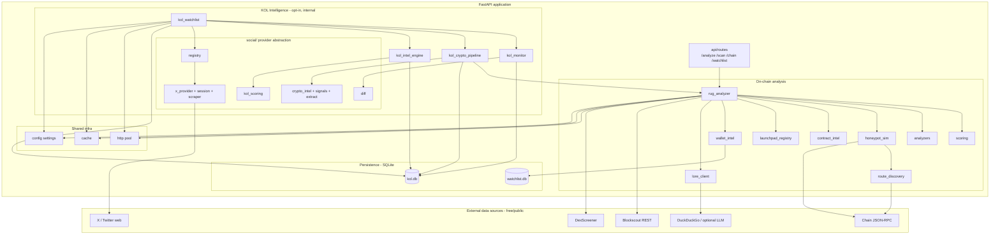
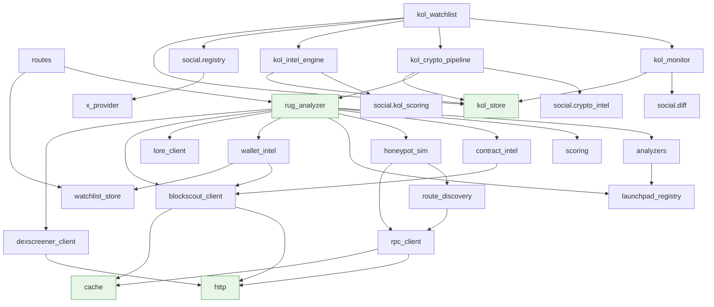
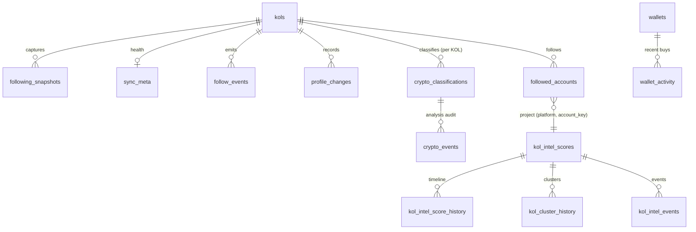
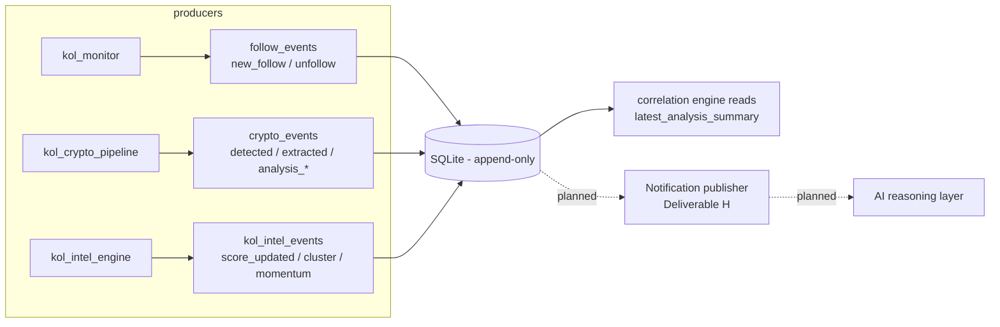
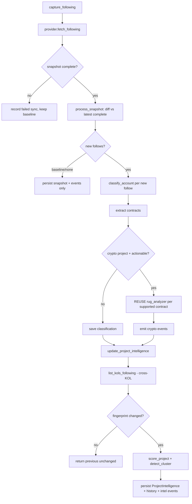
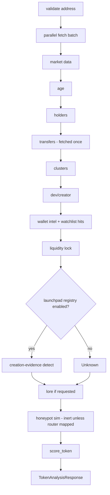
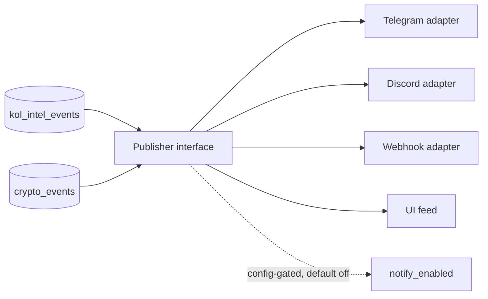
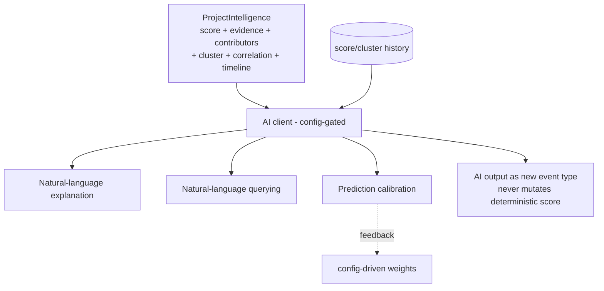

# Architecture Diagrams

Rendered Mermaid diagrams for the Robinhood Rug Analyzer. Companion to
[`ARCHITECTURE.md`](./ARCHITECTURE.md). Diagrams reflect the **implemented**
system; planned/unbuilt elements are marked as such.

---

## Overall architecture

---

## Service dependency graph

Green nodes are the most-reused/shared services. Note the single reuse edge
`kol_crypto_pipeline → rug_analyzer` and the absence of any back-edges (no
cycles).

---

## Database relationships

`wallets` / `wallet_activity` live in the separate `watchlist.db`; all other
tables live in `kol.db`.

---

## Event pipeline

---

## KOL pipeline (end-to-end)

---

## Analysis pipeline (composition order)

---

## Notification architecture (planned - Deliverable H)

*Not implemented. Shown as the intended shape: adapters read existing event
tables; producers are unchanged.*

---

## Future AI architecture (planned)

*Not implemented. Reuses the optional-LLM pattern from `lore_client`.*
