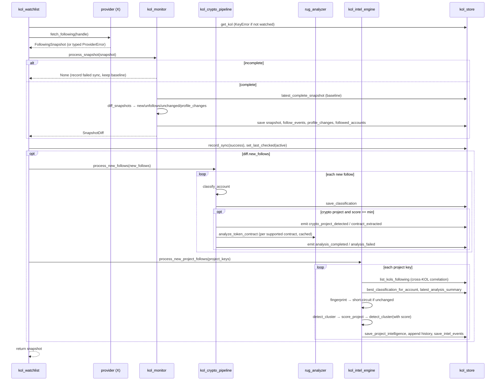

# End-to-End Data Flow

Call-by-call lifecycle for both entry paths. Companion to
[`ARCHITECTURE.md`](./ARCHITECTURE.md) (see §2 for the summary flowcharts). This
document traces what actually happens in the code, in order.

---

## Path A — On-chain analysis (`POST /api/v1/analyze`)

```mermaid
sequenceDiagram
    participant C as Client
    participant R as routes
    participant RA as rug_analyzer
    participant BS as blockscout_client
    participant DS as dexscreener_client
    participant HP as honeypot_sim
    participant SC as scoring

    C->>R: POST /analyze {contract_address}
    R->>RA: analyze_token_contract(addr)
    RA->>RA: validate address (ValueError if bad)
    par parallel fetch batch
        RA->>DS: fetch_token_pairs
        RA->>BS: get_token_info / get_address_info / get_token_holders_paged / get_token_counters
        RA->>BS: get_smart_contract (verified source + ABI; shared by intel + privileges)
    end
    RA->>RA: market data, age, holders (LP excluded)
    RA->>BS: get_token_transfers (once, reused)
    RA->>RA: clusters (funder trace), dev/creator, insiders, watchlist hits
    RA->>RA: liquidity lock; launchpad (only if registry enabled)
    RA->>HP: simulate (inert unless router mapped)
    HP-->>RA: HoneypotResult (or "unknown")
    RA->>SC: score_token(all dimensions)
    SC-->>RA: RugAnalysis (score, level, signals, confidence)
    RA-->>C: TokenAnalysisResponse
```

**Ordered steps** (see [`ARCHITECTURE.md` §9.1](./ARCHITECTURE.md#91-analyze_token_contract--composition-order)):
validate → parallel fetch → market data → age → holders → transfers (once) →
clusters → dev/creator → wallet intel → liquidity lock → launchpad (gated) →
lore (optional) → honeypot → score → response.

**Scan path** (`POST /scan`): cap the limit → `list_tokens` → drop established
tokens → per token run a cheap `score_token_light`; **promote to full analysis**
unless the token is confidently safe (known holder count `>=` floor AND light
score below the promote threshold) → sort by risk descending.

**Degradation:** every external read returns `None`/`[]` on failure; a bad token
in a scan is dropped, not fatal; the honeypot sim returns `"unknown"` rather
than a false verdict.

---

## Path B — KOL Intelligence (`kol_watchlist.capture_following`)

The requested canonical lifecycle, mapped to the actual call chain:

```text
KOL Follow            → a tracked KOL follows a new X account
  ↓
Snapshot              → provider.fetch_following → FollowingSnapshot (complete flag)
  ↓
Diff Engine           → kol_monitor.process_snapshot → social.diff.diff_snapshots
  ↓                      (baseline emits nothing; incomplete is skipped)
Crypto Detection      → crypto_intel.classify_account (corroboration-gated)
  ↓
Contract Extraction   → contract_extract.extract_from_fields (EVM validated)
  ↓
Contract Analysis     → REUSE rug_analyzer.analyze_token_contract (cached)
  ↓
Honeypot Simulation   → runs inside the analyzer (route_discovery + eth_call)
  ↓
Risk Analysis         → runs inside the analyzer (scoring)
  ↓
Alpha Score           → reserved KOL component, inert (no scorer exists)
  ↓
KOL Correlation       → kol_store.list_kols_following (who follows this project)
  ↓
Project Intelligence  → kol_scoring.score_project + detect_cluster → ProjectIntelligence
  ↓
Event Generation      → kol_intel_events (score_updated, cluster, momentum, ...)
  ↓
Notification Layer    → notifications.dispatch_events (M23-H) → rule-filter →
                         deliver via each configured provider (M26: log/memory +
                         webhook/telegram/discord transports) → record + dedupe
  ↓
Future AI Reasoning   → PLANNED — consumes ProjectIntelligence + timelines
```

### Exact call chain



### Invariants along Path B

- **Baseline safety** — the first snapshot yields no follow events.
- **Incomplete-capture safety** — an incomplete snapshot is never diffed and never overwrites the baseline (no false mass-unfollow).
- **Reuse** — the crypto pipeline calls the existing analyzer through a per-address TTL cache (deduped across KOLs); correlation reads the stored analysis summary, never recomputing.
- **Incremental** — `update_project_intelligence` fingerprints inputs and returns the previous object unchanged when nothing changed (no rescore/history/events).
- **Best-effort** — the crypto and intel stages are wrapped in try/except and swallowed; a failure there never sinks a capture that already succeeded.
- **Delivery is downstream + isolated** — the pipeline's job ends at persisted engine-internal events; the notification layer (below) consumes them separately, and a delivery failure can never reach back into capture/analysis. AI reasoning remains planned, not built.

### Automating Path B (M25)

Path B above traces **one** `capture_following` call. In production that call is
driven by the **KOL scheduler** (`app/services/kol_scheduler.py`, run by
`main.py`'s `_kol_scheduler_loop`, gated by `kol_scheduler_enabled`), so no human
has to trigger captures:

```text
_kol_scheduler_loop (every kol_scheduler_interval_seconds)
  ↓
kol_scheduler.run_cycle()          → declines if a prior cycle still holds the lock
  ↓ list enabled KOLs (kol_watchlist.list_kols(enabled_only=True); disabled skipped)
  ↓ bounded fan-out (asyncio.Semaphore, kol_scheduler_concurrency)
capture_one(entry)  per KOL        → skip if no capture-capable provider
  ↓ asyncio.wait_for(timeout) + retry/backoff (retryable ProviderError / timeout only)
kol_watchlist.capture_following(…) → the ENTIRE Path B above, unchanged
```

The scheduler owns **only** orchestration — it adds no intelligence logic. Each
KOL is isolated (one failure/hang never sinks the cycle; a cycle never kills the
loop), and **resume-after-restart is free**: all state (snapshots, `sync_meta`,
followed accounts) already lives in `kol_store`, so a fresh process just resumes
iterating the persisted roster and diffs against the last persisted snapshot.

### Notification delivery (Deliverable H + M26 transports)

`kol_intel_engine._persist_and_emit` makes one call — `notifications.dispatch_events(events, intel)` —
right after it persists the events. Delivery reuses the already-computed
`ProjectIntelligence`; it recomputes nothing:

```text
dispatch_events(events, intel)     → no-op if notify_enabled is off (zero overhead)
  ↓ per event: _passes_rules (type / score / confidence / cluster-size, all config-AND-ed)
  ↓ per configured provider in notify_providers:
_deliver_one(name, event, …)       → skip if (event_key, destination) already delivered (dedupe)
  ↓ retry loop (notify_retry_count, linear backoff) around provider.send:
      log / memory                 → always-available sinks (never fail)
      webhook  → HTTP POST JSON (+ optional HMAC-SHA256 signature header)
      telegram → Bot API sendMessage (Markdown)
      discord  → webhook POST (rich embed)
  ↓ record_delivery (status/error/attempted_at) — the audit log + dedupe seam
```

Each transport does one synchronous `httpx.Client` POST and **raises** on any
non-2xx / transport error, so the dispatcher's shared retry + failure isolation
handle every provider uniformly: one destination failing never blocks the others,
and no delivery failure ever propagates back to the engine. A transport whose
required config (URL / token) is absent self-skips (a recorded `failed`, never a
crash). The providers know nothing about KOLs, scoring, or clustering — they
receive a ready-made `Notification` and ship its `title`/`body`/`payload`.

### Watchlist alerts (M27)

Two event streams that were produced but never delivered — token-monitor change
events (M24) and KOL new-follow events (M23) — now reach the notification
providers through the **alert engine** (`app/services/alert_engine.py`), gated by
`alerts_enabled`:

```text
token_monitor.run_cycle → per token: monitor_once → MonitorEvents (risk/liquidity/
  honeypot/concentration/smart-wallet/privilege/…)
     ↓ alert_engine.process_monitor_result(result, entry)   [isolated, no-op if disabled]
kol_watchlist.capture_following → diff.events() → new_follow FollowEvents
     ↓ alert_engine.process_follow_events(platform, handle, events)
  ↓ evaluate(events, subject): EVENT_TO_ALERT map → per-type rule (enabled?
       per-token override > global > default) → severity gate → optional aggregate
  ↓ dispatch(alerts): cooldown (from the persisted delivery log) + dedupe
notifications.deliver(Notification, provider)   → the SAME M23-H/M26 delivery path
```

The engine only *connects* — it maps each existing event to one of ten alert
types, renders a human-readable message from the event's own payload, and reuses
`notifications.deliver` (providers + retry + dedupe + audit). It computes nothing,
generates no events, and is a no-op with zero overhead when `alerts_enabled` is
off. The concentration / smart-wallet / privilege alert types are fed by three
scalars `MonitorSnapshot` now copies verbatim from the reused analysis.

---

## Where caching vs persistence sits

| Concern | Mechanism | Lifetime |
|---|---|---|
| Immutable external reads (verified source, creation facts, tx/logs, earliest-funder txs) | `TTLCache` (in-process) | 300s, per process |
| Market/token reads (DexScreener pairs, `token_info`, `token_counters`) | short-TTL `TTLCache` | ~15s (`market_cache_ttl_seconds`) |
| Executed honeypot verdicts | `TTLCache` | TTL-bounded; "unknown" never cached |
| KOL contract analysis dedup | per-address `TTLCache` in `kol_crypto_pipeline` | 600s |
| Wallet watchlist | `watchlist.db` | durable |
| KOL snapshots, events, intelligence, history | `kol.db` | durable (with per-table retention) |

Holder lists and transfer history stay **always-live** (never cached). The short
market cache only collapses duplicate reads within a scan burst / rapid re-analysis
— a single analyze reads each source once, so per-analyze output is unchanged — and
errors are never cached, so a transient failure is always retried.

## Chain resolution (M22)

Every chain-specific value a step reads — the Blockscout base URL, the RPC URL,
the DexScreener chainId filter, and the honeypot DEX topology (wrapped-native,
v3 factory, routers, quote assets, fee tiers, reserve floors) — is resolved
through `app/core/chains.active()`, which returns the active `ChainConfig`. Today
exactly one chain is registered (Robinhood Chain, the default), built **live from
`settings`** on each call, so behaviour is identical to reading `settings`
directly — this is purely the seam a future second chain would register against.
Simulation *policy* (prober bytecode, buy amount, tax threshold) is chain-agnostic
and stays in `settings`, not in `ChainConfig`.

---

## Frontend interaction flow (static UI, ES modules under `frontend/js/`)

The UI is a thin same-origin client over the existing API — it adds **no** data or
logic, only how a request is triggered and how progress/results are shown. A
production-readiness polish pass (post-M27) wired every long-running action through
one shared UX path:

```text
user action (submit / token click / recent-search chip)
  ↓ per-action in-flight flag set  → duplicate clicks/submits ignored
  ↓ button locked (disabled + "…") ; indeterminate progress bar + staged status
  ↓ skeleton placeholders fill the results area
fetch(/api/v1/… )                  → the SAME endpoint, unchanged request body
  ↓ ok    → progress snaps to 100%, results render (fade-in), recent-search stored
  ↓ error → progress stops, controls restored, clean message shown
  ↓ finally → in-flight flag cleared, button restored
```

**Token navigation:** clicking a discovered token (ranked scanner row, or a Smart
Wallet's recent-buy token) calls `analyzeAddress(contract)` — it reuses the contract
the backend already returned (no extra lookup), switches to the Analyze tab, populates
the field, and submits the normal `POST /api/v1/analyze`. External **Copy / Blockscout
/ DexScreener** actions are built from the one-time `GET /api/v1/chain` read. **Recent
searches** persist the last 10 analyzed contracts in `localStorage` (client-only). None
of this touches the backend, scoring, or the API contract.
