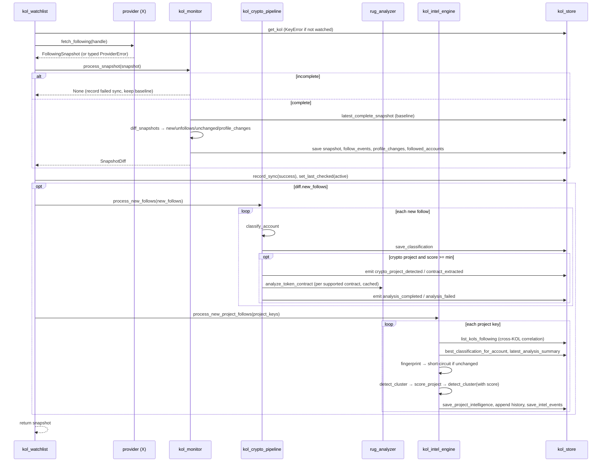

# End-to-End Data Flow

Call-by-call lifecycle for both entry paths. Companion to
[`ARCHITECTURE.md`](./ARCHITECTURE.md) (see §2 for the summary flowcharts). This
document traces what actually happens in the code, in order.

---

## Path A — On-chain analysis (`POST /api/v1/analyze`)

```mermaid
sequenceDiagram
    participant C as Client
    participant R as routes
    participant RA as rug_analyzer
    participant BS as blockscout_client
    participant DS as dexscreener_client
    participant HP as honeypot_sim
    participant SC as scoring

    C->>R: POST /analyze {contract_address}
    R->>RA: analyze_token_contract(addr)
    RA->>RA: validate address (ValueError if bad)
    par parallel fetch batch
        RA->>DS: fetch_token_pairs
        RA->>BS: get_token_info / get_address_info / get_token_holders_paged / get_token_counters
        RA->>BS: get_smart_contract (verified source + ABI; shared by intel + privileges)
    end
    RA->>RA: market data, age, holders (LP excluded)
    RA->>BS: get_token_transfers (once, reused)
    RA->>RA: clusters (funder trace), dev/creator, insiders, watchlist hits
    RA->>RA: liquidity lock; launchpad (only if registry enabled)
    RA->>HP: simulate (inert unless router mapped)
    HP-->>RA: HoneypotResult (or "unknown")
    RA->>SC: score_token(all dimensions)
    SC-->>RA: RugAnalysis (score, level, signals, confidence)
    RA-->>C: TokenAnalysisResponse
```

**Ordered steps** (see [`ARCHITECTURE.md` §9.1](./ARCHITECTURE.md#91-analyze_token_contract--composition-order)):
validate → parallel fetch → market data → age → holders → transfers (once) →
clusters → dev/creator → wallet intel → liquidity lock → launchpad (gated) →
lore (optional) → honeypot → score → response.

**Scan path** (`POST /scan`): cap the limit → `list_tokens` → drop established
tokens → per token run a cheap `score_token_light`; **promote to full analysis**
unless the token is confidently safe (known holder count `>=` floor AND light
score below the promote threshold) → sort by risk descending.

**Degradation:** every external read returns `None`/`[]` on failure; a bad token
in a scan is dropped, not fatal; the honeypot sim returns `"unknown"` rather
than a false verdict.

---

## Path B — KOL Intelligence (`kol_watchlist.capture_following`)

The requested canonical lifecycle, mapped to the actual call chain:

```text
KOL Follow            → a tracked KOL follows a new X account
  ↓
Snapshot              → provider.fetch_following → FollowingSnapshot (complete flag)
  ↓
Diff Engine           → kol_monitor.process_snapshot → social.diff.diff_snapshots
  ↓                      (baseline emits nothing; incomplete is skipped)
Crypto Detection      → crypto_intel.classify_account (corroboration-gated)
  ↓
Contract Extraction   → contract_extract.extract_from_fields (EVM validated)
  ↓
Contract Analysis     → REUSE rug_analyzer.analyze_token_contract (cached)
  ↓
Honeypot Simulation   → runs inside the analyzer (route_discovery + eth_call)
  ↓
Risk Analysis         → runs inside the analyzer (scoring)
  ↓
Alpha Score           → reserved KOL component, inert (no scorer exists)
  ↓
KOL Correlation       → kol_store.list_kols_following (who follows this project)
  ↓
Project Intelligence  → kol_scoring.score_project + detect_cluster → ProjectIntelligence
  ↓
Event Generation      → kol_intel_events (score_updated, cluster, momentum, ...)
  ↓
Notification Layer    → PLANNED (Deliverable H) — no transport exists yet
  ↓
Future AI Reasoning   → PLANNED — consumes ProjectIntelligence + timelines
```

### Exact call chain



### Invariants along Path B

- **Baseline safety** — the first snapshot yields no follow events.
- **Incomplete-capture safety** — an incomplete snapshot is never diffed and never overwrites the baseline (no false mass-unfollow).
- **Reuse** — the crypto pipeline calls the existing analyzer through a per-address TTL cache (deduped across KOLs); correlation reads the stored analysis summary, never recomputing.
- **Incremental** — `update_project_intelligence` fingerprints inputs and returns the previous object unchanged when nothing changed (no rescore/history/events).
- **Best-effort** — the crypto and intel stages are wrapped in try/except and swallowed; a failure there never sinks a capture that already succeeded.
- **Internal-only** — the flow ends at persisted engine-internal events. Delivery (notification) and AI reasoning are planned, not built.

---

## Where caching vs persistence sits

| Concern | Mechanism | Lifetime |
|---|---|---|
| Immutable external reads (verified source, creation facts, tx/logs) | `TTLCache` (in-process) | TTL-bounded, per process |
| Executed honeypot verdicts | `TTLCache` | TTL-bounded; "unknown" never cached |
| KOL contract analysis dedup | per-address `TTLCache` in `kol_crypto_pipeline` | 600s |
| Wallet watchlist | `watchlist.db` | durable |
| KOL snapshots, events, intelligence, history | `kol.db` | durable (with per-table retention) |

Freshness-sensitive data (market, holders, transfers) is **never cached** so
scoring always sees live data.

## Chain resolution (M22)

Every chain-specific value a step reads — the Blockscout base URL, the RPC URL,
the DexScreener chainId filter, and the honeypot DEX topology (wrapped-native,
v3 factory, routers, quote assets, fee tiers, reserve floors) — is resolved
through `app/core/chains.active()`, which returns the active `ChainConfig`. Today
exactly one chain is registered (Robinhood Chain, the default), built **live from
`settings`** on each call, so behaviour is identical to reading `settings`
directly — this is purely the seam a future second chain would register against.
Simulation *policy* (prober bytecode, buy amount, tax threshold) is chain-agnostic
and stays in `settings`, not in `ChainConfig`.
